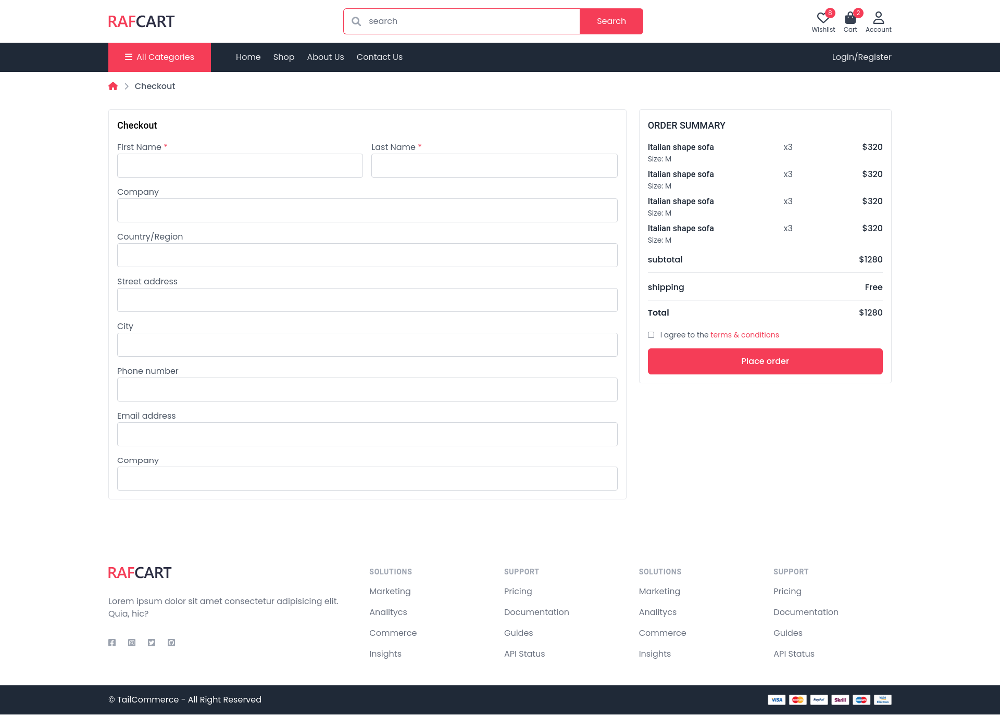
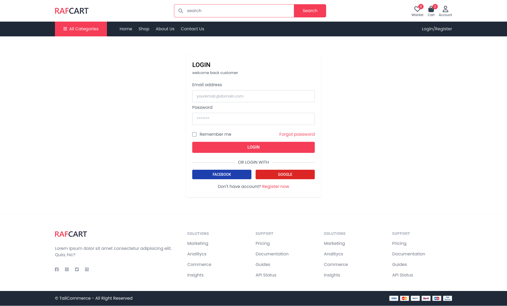
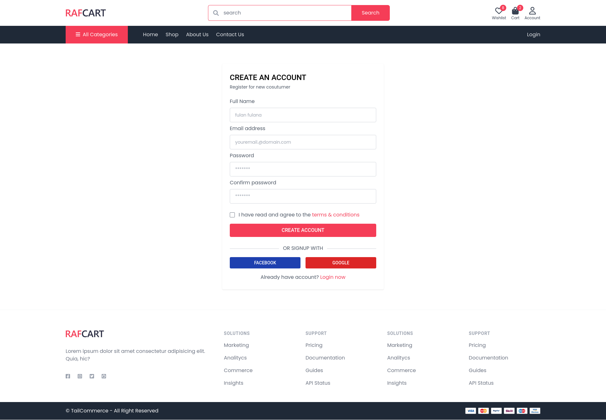

<br/>
<p align="center">
  <h3 align="center">Ecommerce Tailwind Template</h3>

  <p align="center">
    an ecommerce template using tailwind css v3
    <br/>
    <br/>
  </p>
</p>


## About The Project


Ecommerce Tailwind project.

## Screenshots
<details>
<summary>Homepage</summary>


</details>

<details>
<summary>Account</summary>


</details>

<details>
<summary>Checkout</summary>


</details>

<details>
<summary>Login</summary>


</details>

<details>
<summary>Register</summary>


</details>

<details>
<summary>Shop</summary>


</details>

<details>
<summary>Product</summary>


</details>

<details>
<summary>Wishlist</summary>


</details>

## Prerequisites

This is an example of how to list things you need to use the software and how to install them.

* npm

```sh
npm install npm@latest -g
```

### Installation

1. Clone the repo

```sh
git clone https://github.com/ArianaGonzabay/Backend-LP.git
```

2. Install NPM packages

```sh
npm install
```

3. run npm run build

```sh
npm run build
```


## Authors

* **Fajar Siagian** - *Fullstack Developer* - [Fajar Siagian](https://github.com/fajar7xx/) - *author*

